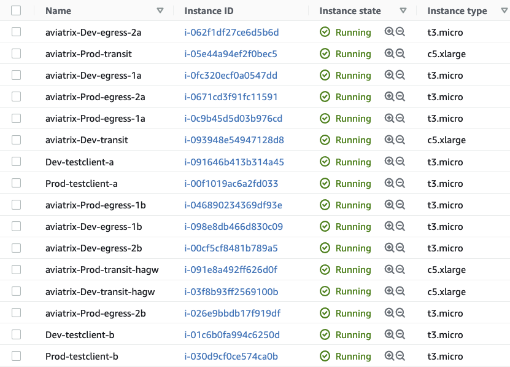
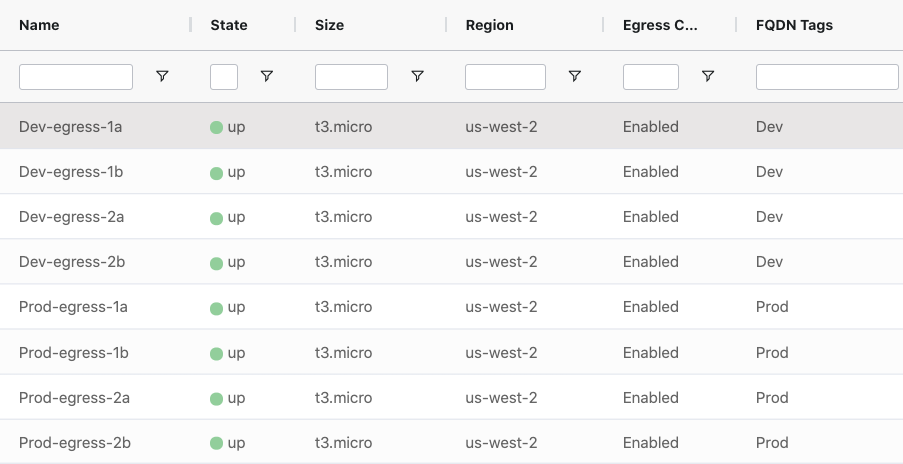

# TGW Firenet With Multiple Security VPCs

### Description
This template deploys an Aviatrix managed TGW and creates a configurable number of security domains with a separate Firenet for each of them containing a configurable number of Egress FQDN gateways. The spoke security domains will be connected to their respective Firenet Egress domains to isolate the egress traffic. E.g., Prod spokes will egress via the Prod Firenet, Dev spokes will egress via the Dev firenet. FQDN tags will also be created for the configured security domains and the respective FQDN gateways will be attached to them.

### Compatibility
Terraform version | Controller version | Terraform provider version
:--- | :--- | :---
0.14 | 6.4d | 2.19.5

### Diagram


### AWS Instances Created



### Egress FQDN Gateway List


### Variables

Modify ```terraform.tfvars``` as needed for your configuration.

- **region:** The region where you wish to deploy the template
- **account:** The Onboarded AWS account in the controller which will be used to deploy the resources in the template
- **spokes:** A map of spoke VPCs and their respective CIDRS. The keys in the map **must** match the keys in the firenets map, as a security domain will be created for each of them and the spokes will be connected to their respective firenet egress security domain.
- **firenets:** A map of transit firenet VPCs and their respective CIDRS. The template will deploy HA transits in each of these VPCs with a variable number of associated Egress FQDN gateways.
- **egress_gw_per_az:** How many egress FQDN gateways you want to associate with each Transit gateway/hagw. This is basically a multiplier. E.g., if set to 2, the template will create and associate two FQDN gateway with both the primary and hagw transits (4 total per firenet VPC). 
- **transit_gw_instance_size:** Size of the transit gateway instances in the firenet VPCs (default and minimum is c5.xlarge).
- **egress_gw_instance_size:** Size of the Egress FQDN gateway instances in the firenet VPCs (defualt is t3.micro).
- **testclient_instance_size:** Size of the test client instances which are deployed in the spoke VPCs (default is t3.micro).

### Dependencies

- Software version requirements met
- Aviatrix Controller with Access Account defined for AWS
- Sufficient limits in place for CSPs and regions in scope **_(EIPs, Compute quotas, etc.)_**

### Workflow

- Modify ```terraform.tfvars``` as needed
- ```terraform init```
- ```terraform plan```
- ```terraform apply --auto-approve```

### Terraform state (post-provisioning)

```
$ terraform state list
data.aws_ami.amazon-linux
aviatrix_aws_tgw.test_aws_tgw
aviatrix_aws_tgw_security_domain.Aviatrix_Edge_Domain
aviatrix_aws_tgw_security_domain.Default_Domain
aviatrix_aws_tgw_security_domain.Shared_Service_Domain
aviatrix_aws_tgw_security_domain.firenet_sec_domain["Dev"]
aviatrix_aws_tgw_security_domain.firenet_sec_domain["Prod"]
aviatrix_aws_tgw_security_domain.spoke_sec_domain["Dev"]
aviatrix_aws_tgw_security_domain.spoke_sec_domain["Prod"]
aviatrix_aws_tgw_security_domain_connection.default_sd_conn1
aviatrix_aws_tgw_security_domain_connection.default_sd_conn2
aviatrix_aws_tgw_security_domain_connection.default_sd_conn3
aviatrix_aws_tgw_security_domain_connection.spoke_to_egress["Dev"]
aviatrix_aws_tgw_security_domain_connection.spoke_to_egress["Prod"]
aviatrix_aws_tgw_vpc_attachment.firenet_tgw_attachment["Dev"]
aviatrix_aws_tgw_vpc_attachment.firenet_tgw_attachment["Prod"]
aviatrix_aws_tgw_vpc_attachment.spoke_tgw_attachment["Dev"]
aviatrix_aws_tgw_vpc_attachment.spoke_tgw_attachment["Prod"]
aviatrix_firenet.test_firenet["Dev"]
aviatrix_firenet.test_firenet["Prod"]
aviatrix_firewall_instance_association.fqdn_fnet_association["Dev-egress-1a"]
aviatrix_firewall_instance_association.fqdn_fnet_association["Dev-egress-1b"]
aviatrix_firewall_instance_association.fqdn_fnet_association["Dev-egress-2a"]
aviatrix_firewall_instance_association.fqdn_fnet_association["Dev-egress-2b"]
aviatrix_firewall_instance_association.fqdn_fnet_association["Prod-egress-1a"]
aviatrix_firewall_instance_association.fqdn_fnet_association["Prod-egress-1b"]
aviatrix_firewall_instance_association.fqdn_fnet_association["Prod-egress-2a"]
aviatrix_firewall_instance_association.fqdn_fnet_association["Prod-egress-2b"]
aviatrix_fqdn.fqdn_tag["Dev"]
aviatrix_fqdn.fqdn_tag["Prod"]
aviatrix_gateway.egress["Dev-egress-1a"]
aviatrix_gateway.egress["Dev-egress-1b"]
aviatrix_gateway.egress["Dev-egress-2a"]
aviatrix_gateway.egress["Dev-egress-2b"]
aviatrix_gateway.egress["Prod-egress-1a"]
aviatrix_gateway.egress["Prod-egress-1b"]
aviatrix_gateway.egress["Prod-egress-2a"]
aviatrix_gateway.egress["Prod-egress-2b"]
aviatrix_transit_gateway.firenet_transit["Dev"]
aviatrix_transit_gateway.firenet_transit["Prod"]
aviatrix_vpc.firenet_vpc["Dev"]
aviatrix_vpc.firenet_vpc["Prod"]
aviatrix_vpc.spoke_vpc["Dev"]
aviatrix_vpc.spoke_vpc["Prod"]
aws_instance.test_client["Dev-testclient-a"]
aws_instance.test_client["Dev-testclient-b"]
aws_instance.test_client["Prod-testclient-a"]
aws_instance.test_client["Prod-testclient-b"]
aws_key_pair.testclient_key
aws_security_group.test_client["Dev"]
aws_security_group.test_client["Prod"]
tls_private_key.testclient_key
```
